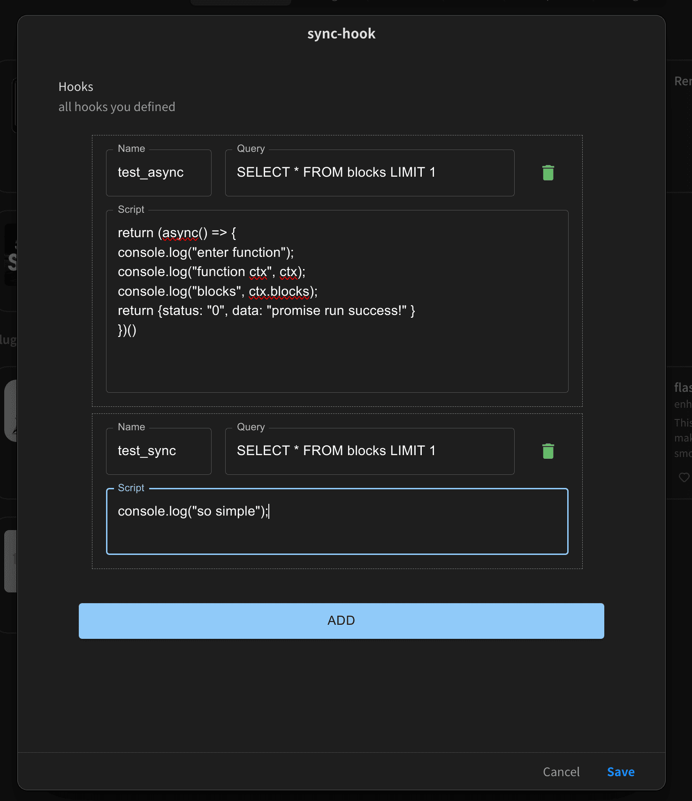

# SiYuan Sync Hook

[中文版](./README_zh_CN.md)

**CAUTION: basic programming skills are required to utilize this plugin.**

**Still in early development stage. Many functions are still TODO.**

This plugin is designed for those who have a basic understanding of programming. It can be considered a platform to run lightweight scripts.

Sometimes we may want to integrate some simple utilities into SiYuan Note.  
Writing a standalone is a bit too heavy for that.  
Writing a script is just fine, but sometimes we may want synchronization or so.  
And yeah, we may want to trigger SyncHook **automatically** based on certain criteria.  
SyncHook aims to tackle this problem.

# Usage

Add hooks in Plugin Settings.

Currently, only CustomHook is supported as the default hook type. 

You need to specify three properties: hook name, SQL query string, and the script.

Currently only JavaScript is supported. You can write arbitary script and it will execute in SiYuan frontend. 



Specially, script input and output follows such interface:

```ts
function (ctx: RuntimeContext): HookRes {
    // your code goes here...
}
```

Runtime Context: 

```ts
type RuntimeContext = {
    hook: {
        id: string,
        name: string,
        query: string,
        script: string
    },
    blocks: {
        id: string,
		parent_id: string,
		root_id: string,
		created: string,
		updated: string,
		last_update: string,
		content: string,
		markdown: string,
    }[]
}
```

Your script may or may not return a value. If value is returned, it should follow such format:

```ts
type HookReturn = {
    // custom status code. 
    // convention: 0 for success 
    // codes < 0 are reserved for internal usage.
    status: string,      
    data?: any,
    err?: any
}
```

Internal codes:

- -1: Exception occured when running Hook.
- -2: Parse return value failed.

## Asynchronization

You can efficiently run async function in the script. Just wrap to return promise:

```ts
return (async () => {
    return { status: "0" }
})();
```

Promise will be automatically resolved in SyncHook Plugin.

## TypeScript

Currently, I haven't supported directly execute TypeScript yet. But it's easy to transcompile TypeScript to JavaScript for execution.

## Other Languages

It's possible to run many other languages. Python is my next option.

## Templated Hook

Many times we may want to define some **frequently used Hook Template**. We can define custom SyncHookType, which offers `inputs` for user to fill in settings, and just execute.

Still TODO.

## Trigger Events

Currently only Manual Trigger is supported. But there should be more.

- [ ] Timer Trigger
- ...

# Development

Briefly introducing tech stack used:

- Vite, packaging and HMR.
- Bun, a modern nodejs runtime, but only for development & generating production build.
- Preact, lightweight react alternative.
- MUI, Material UI component framework. A bit too heavy for this task, but offers out of the box usability, which I appreciate.
- valtio, a state management library for react. Since we render detached DOM to SiYuan-Note, managing state across the react-others boundary may require some effort. I use valtio to do global state management.
- tailwind css is installed but not used. Maybe sometime later I would migrate from MUI to tailwind.

# Attribution

This project is licensed under GPLv3.

Special thanks to (plugin-sample-vite-solidjs)[https://github.com/frostime/plugin-sample-vite-solidjs].   
This project is based on the template, but use preact instead of solidjs.
